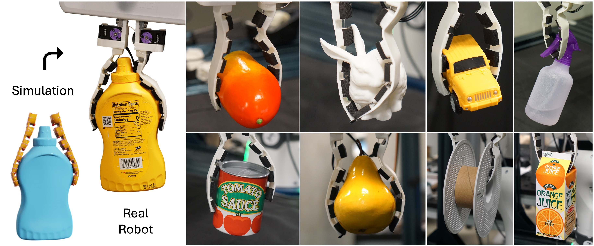

# Co-Design of Soft Gripper with Neural Physics
[[Project page]](https://yswhynot.github.io/codesign-soft/) · [[Paper]](https://arxiv.org/abs/2505.20404)

Sha Yi*, Xueqian Bai*, Adabhav Singh, Jianglong Ye, Michael T. Tolley, Xiaolong Wang   
*Conference on Robot Learning (CoRL), 2025*



## Requirements
- Python 3.10
- GPU optional but recommended (tested on RTX 3090, 4090)
- Key Python deps are listed in `requirements.txt` :
  - warp-lang==1.6.1
  - torch>=2.0
  - numpy, scipy, trimesh, usd-core, tensorboard (optional)

## Installation
```bash
conda create -n codesign python=3.10 
conda activate codesign
pip install -r requirements.txt

# optional: verify Warp
python -c "import warp as wp; print(wp.__version__)"   # expect 1.6.1
```

## Quick start (simulation)
We include the mesh for `006_mustard_bottle` in the YCB dataset so you can try the simulation immediately. For example:
```bash
# simple run with rendering
python code/sim_gen.py --render --object_name 006_mustard_bottle --pose_id 5

# use a trained predictor to automatically pick the best pose
python code/sim_gen.py --render \
  --pick_best_pose \
  --model_name all_layer5_drop0.3_hidden1024_pointout128_batch512_lr0.001_weight0.001_seed42_l1_model
```
Results are written as USD files to `output/`. You can view them with an Omniverse-compatible USD viewer (e.g., `usdview`). The default stiffness distribution is already the optimized values from our trained model.

## Hardware setup
The hardware models, setup, assembly instructions, and motor control scripts are in `hardware/`. See the [README](https://github.com/yswhynot/codesign-soft-gripper/tree/main/hardware) for details.

## Data and assets
- YCB meshes are expected under `models/ycb/<object_name>/google_16k/` with `nontextured.ply`. This repo includes the mustard bottle for convenience. You may download the entire YCB dataset [here](https://www.ycbbenchmarks.com/).
- Pose priors from [AnyGrasp](https://github.com/graspnet/anygrasp_sdk) are stored under `pose_info/` (see that folder’s README for details). Initial finger transforms are cached in `pose_info/init_opt/` to skip re-initialization. If you wish to process new objects, we recommend using our updated AnyGrasp setup [here](https://github.com/Hakuna25/anygrasp_sdk).

## Generate training data
`code/sim_datagen.py` generates simulation rollouts and logs:
```bash
python code/sim_datagen.py \
  --object_name 006_mustard_bottle \
  --use_graph \
  --random \
  --pose_iters 20 \
  --save_log
```
You may add other parameters as needed. Note that GPU memory access will gets tricky when the CUDA graph is used, but it speeds up the simulation significantly once the graph is correctly created.

## Train models
Before training, particle point clouds of the generated data and the corresponding finger poses are needed. You can use the helper script in `code/generate_partial_pointcloud.py` to generate them.  
Use `code/train.py` to train the predictor. Example (see `--help` for full options):
```bash
python code/train.py --object_name all
```
Evaluation helpers are in `code/train_eval.py`.

## Initialization utility
If you wish to add more objects to the data generation and training pipeline,`code/init_pose.py` optimizes for feasible starting finger transforms per object pose based on the Anygrasp initial guess, and caches them in `pose_info/init_opt/`. It is also used to augment existing poses by adding random perturbations `--random`.
```bash
python code/init_pose.py --object_name 006_mustard_bottle --train_iters 15000
```

## Repository structure
- `code/`: simulator, training, and utilities
- `pose_info/`: AnyGrasp wrist/pose priors and cached initial finger transforms
- `hardware/`: models, build notes and motor control
- `hardware/motor_control/`: Dynamixel motor control code
- `models/`: YCB meshes and other models
- `sim_models/`: trained neural physics models

## Citation
```bibtex
@inproceedings{yi2025codesign,
  title     = {Co-Design of Soft Gripper with Neural Physics},
  author    = {Yi, Sha and Bai, Xueqian and Singh, Adabhav and Ye, Jianglong and Tolley, Michael T and Wang, Xiaolong},
  booktitle = {Conference on Robot Learning (CoRL)},
  year      = {2025}
}
```

## License
See `LICENSE` for details.
