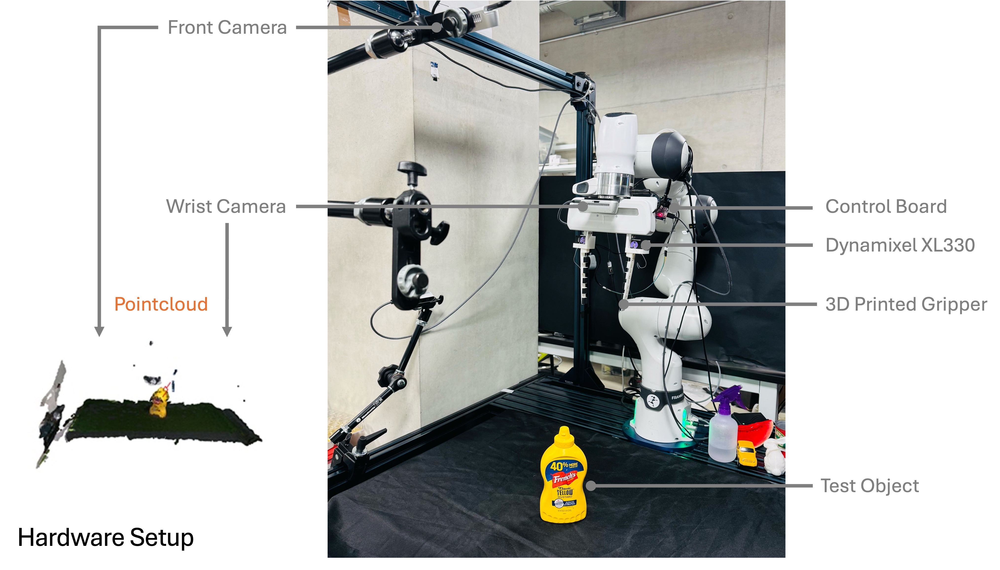

## Overview
This folder contains notes and files for building the physical soft gripper and reproducing hardware experiments. The assembly process takes only roughly 2 minutes.

- See `motor_control/` for Dynamixel-based motor control scripts.
- CAD, fabrication notes, and assembly tips can be found here.

## Preparation
Motor and controller related components:

- DYNAMIXEL XL330-M288-T x2
- DYNAMIXEL U2D2 + Control board x1
- DYNAMIXEL power supply 5V x1
- ROBOTIS Cable-X3P x2

Gripper related components:
- M2 flat washer x4
- M2 screw x2, along with 16 additional screws from the motor kit.
- Fishing line x1, we use Sufix 832 (80 lbs)
- 3M gripping tape x1
- A robot arm. We use Franka and its Franka Hand.

## 3D Printing
Print the gripper parts with NinjaFlex Cheetah (95A). The models are `sim_finger.stl`, and the `.3mf` file is `sim_finger.3mf` if you wish to use our parameters.  

Print the motor horn (`motor_horn.stl`) and a motor mount (`franka_mount.stl`) with PLA (or whatever rigid material of good strength). Tough PLA or PLA-CF is recommended but not necessary.

## Assembly
- Tape the 3M gripping tape to the gripper part to prevent slipping.

- Tie a non-slip knot with the M2 washer and the fishing line. We used the [Kreh Loop Knot](https://www.101knots.com/non-slip-kreh-loop-knot.html).

- Mount the motor horn to the motor, and the motor to the mount. The M2 screws are from the motor kit. Be care that the shorter ones go with the motor horn, and the longer ones go with the motor mount. The M2 washer and screw goes into the center of the motor horn, and leave it loose for now.

- Insert the fishing line into the gripper part and the motor horn. The washer can be pushed into the finger tip, and gets covered by the tape. Make sure the tendon lies underneath washer.

- Tighten the M2 screw in the center of the motor horn to secure the tendon to the motor horn. You may choose to align the tendon inline with the mounting holes as shown in the image above before tightening. However, this can be easily encoded as the zero position in the motor control code. 

Now you can mount the gripper to your robot. Have fun!
